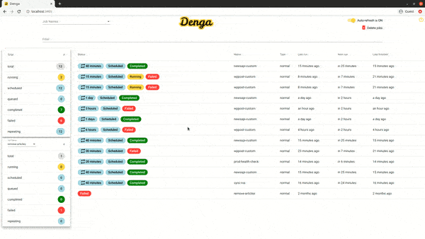

<p align="center">
  
</p>
<p align="center">
A modern Agenda Dashboard made with Angular
</p>

# 
**Note**: You must be using node version 10.15.x or greater to use denga.

:warning: you can install and use the project but some features still under development :construction:

A modern [Agenda](https://github.com/agenda/agenda) Dashboard made with :balloon: Angular :tada:


<!--  -->

<p align="center">
  
</p>


# Features

* Monitor jobs
* Display jobs details
* Display jobs stats
* Filter jobs by name and your own search keys
* Delete jobs by filter
* Requeue and delete jobs 
* Auto refresh with "toggle switch" (on/off) 
* ... WIP :fire:

# Install

```console
$ npm install denga --global
```

# Usage

```console
$ denga --db mongodb://127.0.0.1:27017/denga 
```

# Options


`--db, -d`: (required) connection URI used to connect to a MongoDB

`--port, -p`: (optional) server port, default 3000


`--collection, -c`:	(optional) Mongo collection, same as Agenda collection name, default agendaJobs


`--limit, -l`:	(optional) max number of jobs displayed, default 100


`--title, -t`:	(optional) page title, default Denga

`--keys, -k`:	(optional) (multiple) keys to include in search, you can use dot-notation (.) in a key to access nested properties


# Examples

Example Usage 1

```console
$ denga -p 3010 -c jobs -t myDashBoard --limit=300 -d mongodb://127.0.0.1:27017/denga
```

Example Usage 2


```console
$ denga -p 3010 -c jobs --limit=300 -d mongodb://127.0.0.1:27017/denga -k id -k params.category
```

Consider the following jobs

```json
{
    "name" : "jobTypeOne",
    "data" : {
        "id" : "sports",
        "params" : {
            "source_config" : {
                "from" : {
                    "amount" : 40,
                    "unit" : "minutes"
                },
                "query" : "foot OR soccer OR football"
            },
            "categories" : [ 
                "sports"
            ],
            "tags" : [ 
                "football"
            ]
        }
    },
    ...
}

{
    "name" : "jobTypeTwo",
    "data" : {
        "id" : "football",
        "params" : {
            "category" : "sports"
        }
    },
    ...
}

```


* If you type in the search bar the keyword "sport" both jobs will be returned
* If you type in the search bar the keyword "foot" only jobTypeTwo will be returned

If you want to be able to get both jobs by the keyword "foot", you need to add this key "params.tags" 


# Scripts
In your dev environment, you can kick off the project (server and client) under nodemon with 

```console
$ npm run monitor
```

you can launch an unmonitored process with 
```console
$ npm run all
```

to run build on both server and client-side
```console
$ npm run build 
```

# Project Structure

* client (Angular)
* server (Node.js)

# Requirement
* The Angular CLI requires a minimum Node.js version of either v10.13 or v12.0.


# TODO

- [x] Setup config system (config file and/or command line arguments )
- [x] Display 100 jobs in home page
- [x] Manage refresh
- [x] Manage refresh "toggle switch" (on/off button) 
- [x] Display job details
- [x] Make it run as NodeJS command-line package :sunglasses:
- [x] Make jobs filtrable by name ( Prebuilt just front with Angular Material )
- [x] Ship 1st release :pray: :rocket:
- [x] Requeue and delete jobs
- [x] Make sure to send the user filter in every query
- [x] Make jobs filtrable by custom properties (~ get an array from config file)
- [x] Display some stats
- [x] Delete jobs by filter
- [x] Keep the jobs filtred after a requeue or a delete
- [ ] Create new job from UI
- [ ] ...


# Story
I'm a fan of Agenda :star: , and I'm using it in several projects for a very long time. And I've always used, Agendash as the dashboard, But I must say, it wasn't created to cover all the various situations (I've spent too many hours writing MongoDB queries). 

So making Denga is a way to save some time.

## License
GNU General Public License v3.0